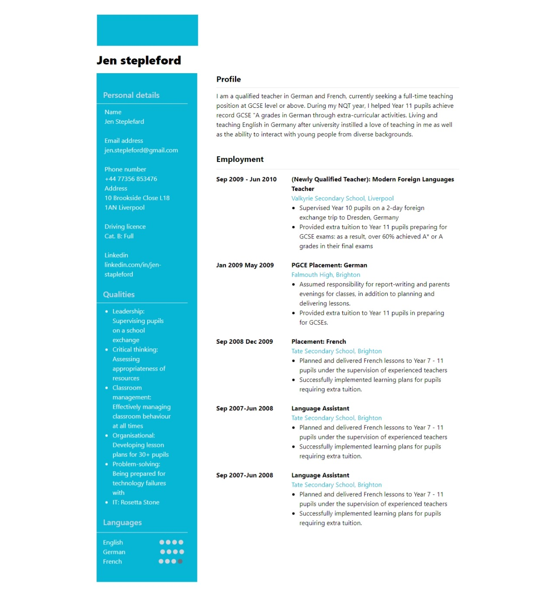

# Tailwind-resume-template
This is resume template using tailwind css.
To run this project you have to install node.js and npm using these commands (npm install -D tailwindcss postcss autoprefixer
npx tailwindcss init) or simply paste this ().

